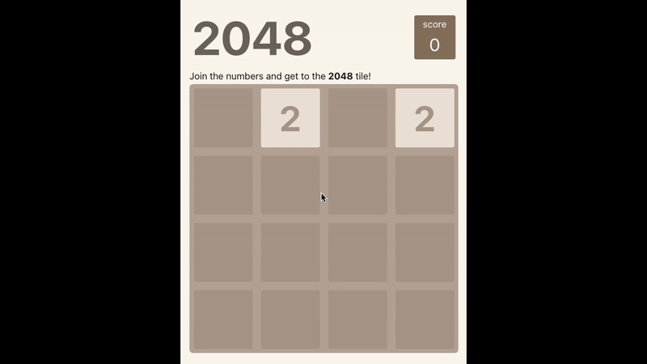

# 2048 Game
This is a simple 2048 game implemented in react. The game is played on a 4x4 grid with numbered tiles that slide when a player moves them using the arrow keys. The game is won when a tile with the number 2048 is created.

## Demo

## How to play
- Use the arrow keys to move the tiles in the desired direction.
- When two tiles with the same number touch, they merge into one tile with the sum of the two numbers.
- The game is won when a tile with the number 2048 is created.
- The game is lost when the grid is full and there are no possible moves left.

## How to run
- Clone the repository
- Run `npm install` to install the dependencies
- Run `npm run dev` to start the development server

## Technologies used
- React
- Typescript
- Vite
- Tailwind CSS

## Deployment
The game is deployed on Netlify. You can play it [here](https://wimpy-2048.netlify.app/).
